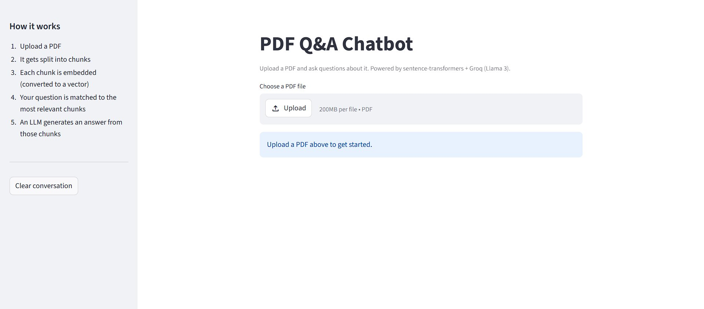
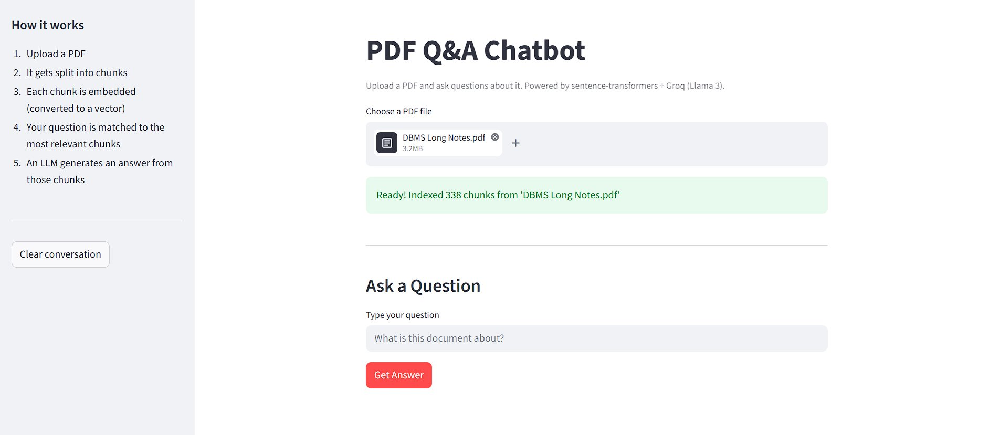
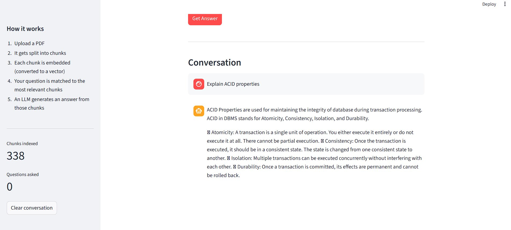
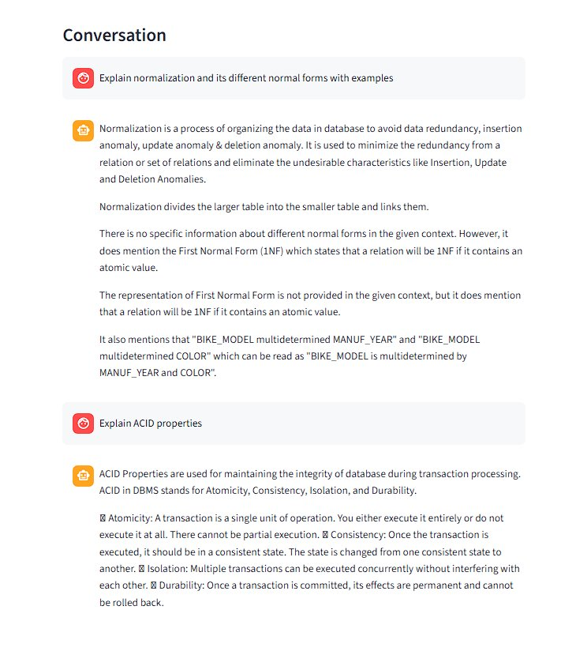
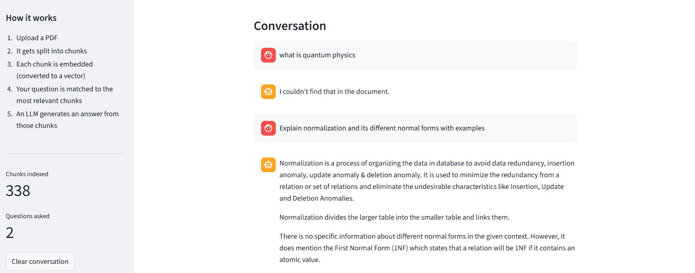
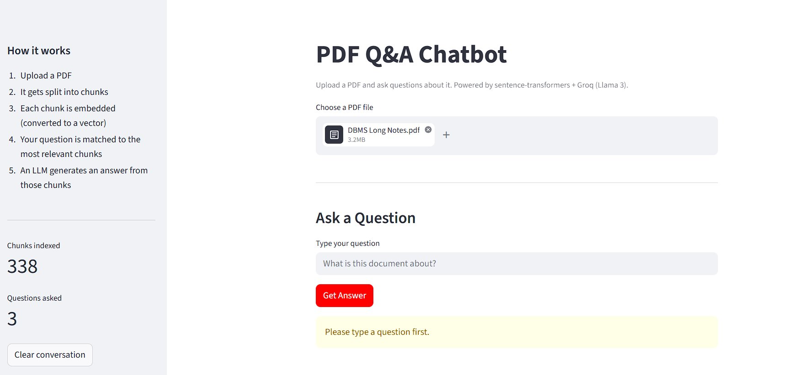

# PDF Q&A Chatbot
 
Upload a PDF and ask questions about it. Built as a beginner RAG learning project.
 
🚀 **Live Demo:** [aastha-pdf-chatbot.streamlit.app](https://aastha-pdf-chatbot.streamlit.app/)
 
---
 
## Stack
- **Embeddings** — sentence-transformers (free, local)
- **Vector Store** — FAISS
- **LLM** — Groq API / Llama 3.1 (free)
- **UI** — Streamlit
---
 
## Screenshots
 

 

 

 

 

 

 
---
 
## Run Locally
 
```bash
git clone https://github.com/YOUR_USERNAME/pdf-qa-chatbot.git
cd pdf-qa-chatbot
python -m venv venv
venv\Scripts\activate
pip install -r requirements.txt
```
 
Create a `.env` file:
```
GROQ_API_KEY=your_key_here
```
 
Get a free key at [console.groq.com](https://console.groq.com).
 
```bash
streamlit run app.py
```